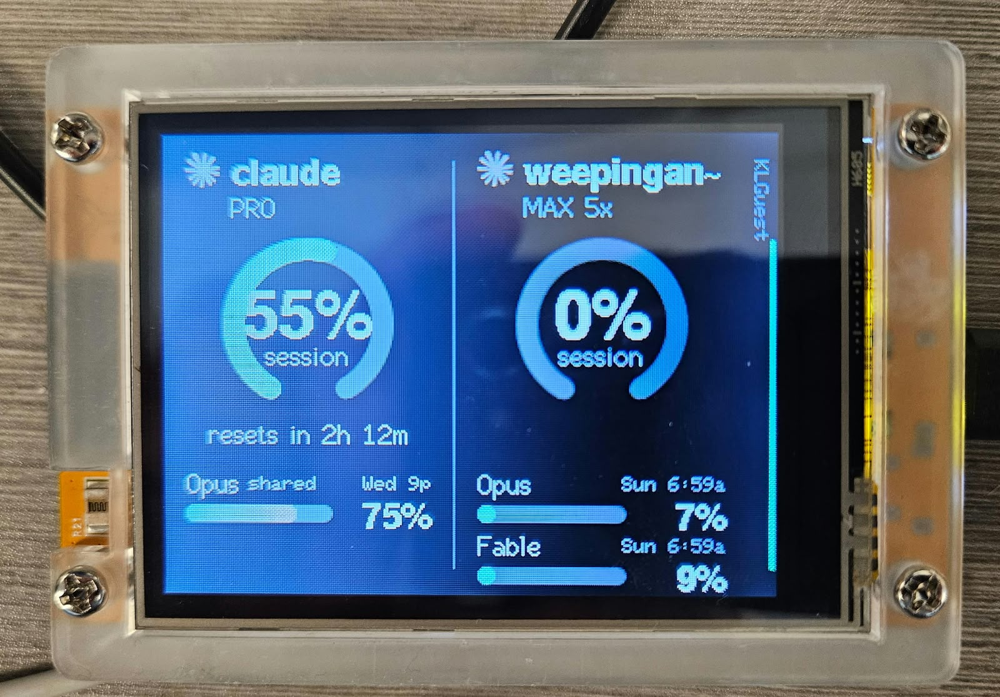

# claude-status

A desk display for Claude usage limits. An ESP32 "Cheap Yellow Display" shows
the session window and per-model weekly limits for up to four Claude accounts,
checking every 15 minutes.

Set it up on the touchscreen and your phone (join its hotspot, sign in to
Claude in the browser), or from a Linux machine with a config file and a script.

- **Ring**: the 5-hour session window, % used, with time until reset.
- **Meters**: the models you choose per account. A model with no limit of its
  own draws on the all-models weekly limit; that's the number shown, tagged
  `shared`.
- **Color**: meters run green until 50%, blend to amber by 75% and red by
  100%. Bars are gradients along that scale.
- **Right edge**: the WiFi name, written vertically, next to a live signal meter.
- A small blue dot shows while a check is running. A failed account keeps its
  last numbers, greyed out, with the error under the ring.

The layout follows the number of accounts:

| Accounts | Layout |
|---|---|
| 1 | Fills the screen: a big session ring on the left, up to four model meters on the right |
| 2 | Side by side, as in the photo |
| 3–4 | Two at a time, flipping to the next page every 12 seconds (`page_seconds`). Swipe sideways, or tap near an edge, to scroll by hand; the timer restarts after a manual scroll. Dots at the bottom and arrows at the edges show where you are |

## Hardware

An ESP32-2432S028 "Cheap Yellow Display": ESP32, 320x240 ILI9341 panel, CH340
USB serial. They're widely available for around $15.

Some units power up with inverted colors. This build sends `INVON` to correct
them (`TFT_INVERSION_ON` in `platformio.ini`). If your screen shows black text
on white, remove that flag.

## Get started

You need the board, a USB data cable, and a Linux machine with Python 3 and
`curl`. Nothing to configure first.

    ./flashonly.sh

It lists the USB serial devices it finds, lets you pick the board, downloads
the latest release, checks its checksum, and flashes it. A board that was
already set up keeps its WiFi, accounts and logins. If `flashonly.sh` can't
open the port: `sudo usermod -aG dialout $USER`, then log out and back in.

Then finish on the board, as described next. Prefer esptool directly? On a
*fresh* board, `esptool --chip esp32 write-flash 0x0 claude-status.bin` with
the image from the [releases page](../../releases). Don't do that on a board
you've set up: the image's padding covers the settings area. `flashonly.sh`
writes around it.

## Set up on the board

1. **WiFi.** The board shows a setup screen. Tap **Use this screen**, pick your
   network and type its password on the on-screen keyboard. Or scan the QR
   code with a phone to join the board's hotspot and pick the network on the
   page that opens.
2. **Accounts.** With no account yet, the board keeps its own hotspot up and
   shows a QR code to join it. On your phone, join, open `http://192.168.4.1`,
   press **Add a Claude account**, name it, choose model meters, tap
   **Open claude.ai**, approve, and paste back the code claude.ai shows.

The hotspot works on guest networks, which stop devices on them from reaching
each other. Its password changes every time and appears only on the screen, so
no PIN is needed on it. While your phone is on the hotspot it has no internet.
If claude.ai won't load, tap **Copy link**, switch back to your usual network,
approve there, copy the code, rejoin the hotspot and reopen the page. It picks
up at the paste step.

### The menu

Press and hold the screen for about 1.5 seconds:

| Item | Does |
|---|---|
| Phone setup page | turns on the board's hotspot and shows its QR code; it turns off after 15 idle minutes |
| WiFi on this screen | pick a network and type its password on the keyboard |
| WiFi with a phone | restarts into the setup hotspot |
| Restart | restarts |
| Close | back to the dashboard |

Changing WiFi never touches accounts or logins. A new network is tested before
it's saved, and cancelling keeps the old one. If the old network is gone and
the board can't show its menu over it, hold the screen while powering on.

## Build from source

For changing the firmware, or for setting a board up from a config file
instead of on its screen. Needs Python 3.11+; PlatformIO installs itself into
`.toolchain/` on first build.

    ./deploy_and_build.sh --web-setup   # build and flash the generic firmware

### Set up with a config file

Needs the `claude` CLI (Claude Code) to create the board's logins.

    ./deploy_and_build.sh            # first run creates ~/.config/claude-status/config.toml
    $EDITOR ~/.config/claude-status/config.toml
    ./login.sh                       # one browser sign-in per account
    ./deploy_and_build.sh            # build and flash

To try the screen without an account or network, run
`./deploy_and_build.sh --demo`. The demo shows made-up numbers and labels
itself "DEMO - not real data". To preview the other layouts, run
`DEMO_ACCOUNTS=1 ./deploy_and_build.sh --demo`, with any count from 1 to 4.

Other options: `--build-only` validates your config and logins and compiles
without flashing. `--monitor` tails the serial console after flashing.
`--erase` wipes the board first; it asks you to type ERASE, because the board
holds the only live copy of each login. Set `PORT=/dev/ttyUSBx` to pick a
specific board.

With `enable_hosting = true` the setup page is also available on your
network, for changing settings or adding accounts from any device there. Its
address appears on the right edge of the screen, next to the WiFi name. This
doesn't work on guest networks; use the menu's **Phone setup page** there.

### Script and website together

The board stores all its settings itself. A script deploy applies
`config.toml` only when the file changed since the last deploy, so settings
changed on the website survive a reflash. When `config.toml` does change,
its account list replaces the board's, and accounts added only on the website
are dropped.

## Configuration

`~/.config/claude-status/config.toml` (see `config.example.toml`):

| Key | Meaning |
|---|---|
| `wifi.ssid`, `wifi.password` | the network the board joins (2.4 GHz) |
| `device.hostname` | how the board appears on your network |
| `device.refresh_scope` | OAuth scope the board keeps; default `user:profile` |
| `device.timezone` | POSIX TZ string; defaults to this computer's |
| `device.page_seconds` | with 3+ accounts, seconds per page; `0` flips only by touch. Default 12 |
| `device.refresh_minutes` | how often to check usage. Default 15 |
| `device.brightness` | backlight %, 5 to 100. Default 90 |
| `device.sleep_minutes` | dim out after this long without a touch or a change; `0` never. Default 0 |
| `device.dim_minutes` | length of that fade before the screen turns off. Default 5 |
| `device.enable_hosting` | keep the setup page on your network. Default false |
| `[[account]]` | one block per account, 1 to 4 |
| `[[account]] alias` | name shown on screen |
| `[[account]] email` | the account's email; `login.sh` refuses a sign-in as anyone else |
| `[[account]] models` | model meters to show, e.g. `["Opus", "Fable"]`; empty shows every limit |

## Screen and power

- The backlight stays at `brightness` while the screen is on.
- With `sleep_minutes` set, the screen fades over `dim_minutes` after that long
  without a touch or a change, then turns off. New numbers, a touch, or a
  change made on the setup page bring it back. While the screen is off, the
  first touch only wakes it.
- WiFi and the setup page stay up while the screen is off.

## How it works

The board calls the endpoint behind Claude Code's `/usage`:

    GET https://api.anthropic.com/api/oauth/usage

Its `limits` array describes every meter: the `session` window, `weekly_all`,
and `weekly_scoped` rows carrying a model's display name. Rows are classified
by kind, the same way Claude Code does it.

Access tokens last a few hours. The board refreshes its own, 5 minutes before
expiry and again on any 401:

    POST https://platform.claude.com/v1/oauth/token

### Why the board has its own logins

Claude's refresh tokens **rotate**: each refresh retires the previous token.
If the board and your desktop share a login, whichever refreshes first logs
the other out. `login.sh` therefore creates a separate login per account,
stored in `~/.config/claude-status/logins/<alias>/`. Only the build reads it.

After its first refresh, the board holds the only live token for that login,
and the copy on disk is spent. Each build stamps every account with a hash of
its login; the board replaces its stored tokens only when that hash changes,
i.e. after you run `login.sh` again. Rebuilding or reflashing keeps the board's
live tokens.

### Signing in on the board

The setup page uses the copy-paste sign-in Claude Code offers for machines
without a browser. The board creates a PKCE challenge, the link takes you to
claude.ai to approve, and claude.ai shows a code that the board exchanges for
tokens. The login belongs to the board alone. Afterwards the board reads the
account's email and plan from the profile endpoint.

### Least privilege

Signing in on the board asks for `user:profile` alone. `claude auth login`
(the script path) always grants Claude Code's full scope set, including running
models, so the board asks for only `user:profile` on every refresh. From its first refresh on, its tokens can read usage
and nothing else. To confirm narrowing works for an account before you
deploy, run `tools/scope_test.py <alias>`.

## Keeping it running

- If a column reads **"Login expired: sign in again"**, the board's login
  chain broke: the login was revoked, the refresh token outlived its lifetime,
  or the board sat unplugged too long. Press **Sign in again** on the setup
  page, or run `./login.sh <alias>` then `./deploy_and_build.sh`.
- Refresh tokens report a lifetime of about 30 days. The serial log prints it on
  every refresh (`refresh token valid N days`), which shows whether it resets
  each time or counts down.
- WiFi stays connected with auto-reconnect. Each check makes 3 join attempts;
  after a failure, retries come at 2, 4 and 8 minutes, then every 15.

## Security

- The repository holds no secrets. Your config and logins live in
  `~/.config/claude-status/`, with mode 700 on directories and 600 on files.
- `include/secrets.h` exists only during a build. It's deleted afterwards,
  together with the compiled objects that embed the tokens.
- Token values are never printed or logged, by the scripts or the firmware.
- The board verifies TLS against pinned roots (`include/certs.h`).
- The setup hotspot is WPA2 with a password that changes every boot and is
  shown only on the screen.
- On your network, any change on the setup page needs a PIN that the board
  displays on request. It's valid for 2 minutes, five wrong guesses cancel it,
  and a correct one signs in one browser.
- The page is plain HTTP. The page never shows tokens, and a sign-in code is
  useless without the PKCE verifier that stays on the board. But someone who
  can watch your network traffic could take over the page session. On a shared
  network, turn hosting off once setup is done.
- Flash encryption is off, so anyone with the board in hand can read its token.
  That token is limited to `user:profile`, meaning your usage numbers. Revoke it
  from your Claude account settings if the board is lost.

## Project layout

| Path | Purpose |
|---|---|
| `flashonly.sh` | pick a USB device, flash the latest release (keeps the board's settings) |
| `deploy_and_build.sh` | build from source and flash, from a config file or generic |
| `tools/make_release.sh` | builds the generic image, `firmware/claude-status.bin` |
| `.github/workflows/release.yml` | builds that image on GitHub and publishes it for each `v*` tag |
| `login.sh` | create and verify the board's own Claude logins |
| `config.example.toml` | config template |
| `src/main.cpp` | boot modes, check scheduler, brightness, dimming and sleep, touch, menu |
| `src/settings.cpp` | settings and logins in the board's flash; applies a script config |
| `src/web.cpp` | setup hotspot, captive portal, setup page API, PIN |
| `src/web_page.h` | the setup page itself |
| `src/wifi_screen.cpp` | WiFi setup on the touchscreen: network list and keyboard |
| `src/api.cpp` | WiFi, NTP, sign-in, token refresh, usage fetch and parsing, demo data |
| `src/ui.cpp` | full-screen, side-by-side and scrolling layouts; ring, meters, WiFi strip |
| `tools/gen_secrets.py` | config + logins → `include/secrets.h` |
| `tools/config.py` | config loading and validation |
| `tools/scope_test.py` | checks that a login can be narrowed to `user:profile` |
| `tools/svg_to_alpha.py` | rasterizes `assets/claude-mark.svg` into `include/claude_mark.h` |
| `include/certs.h` | pinned root CAs for the two TLS endpoints |
| `screenshots/` | photos for this README |

## Releases

GitHub Actions builds the generic firmware for every `v*` tag and attaches
`claude-status.bin` and its checksum to a release. It also checks that the
image embeds no credentials. To cut one: `git tag v1.2.3 && git push origin v1.2.3`.

## Caveats

This project isn't affiliated with Anthropic. It relies on an undocumented
endpoint and on Claude Code's OAuth client, either of which can change without
notice. The Claude mark is Anthropic's trademark.
